# RELAZIONE TECNICA GRUPPO PIKE
## INTRODUZIONE
L’obiettivo del progetto è quello di implementare un’applicazione che permetta di giocare al gioco della dama. 
L’implementazione è stata realizzata in 2 sprint. 
Nel primo sono state implementate le funzionalità riguardanti la parte “interazione tra il sistema e l’utente”; queste funzionalità sono nello specifico: gioca, tempo, mostra la damiera numerata, mostra la damiera con i pezzi.
Nel secondo sprint il focus è stato orientato verso il gioco vero e proprio nel quale sono state implementate le pedine e le dame con le loro rispettive mosse.
## MODELLO DI DOMINIO
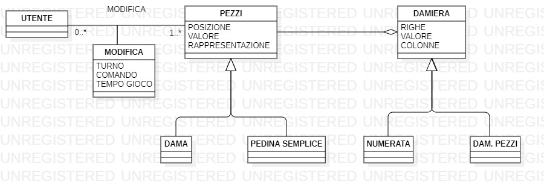
La modellazione del domino è stata progettata utilizzando un diagramma delle classi.
Descrizione del modello:
La modellazione del dominio è indipendente dal software.
La classe utente può modificare zero (in quanto può abbandonare la partita) o più pezzi. Le caratteristiche principali che permettono la modifica di un pezzo sono: il comando che permette l’azione, il tempo di gioco che viene cronometrato sulla base del tempo della giocata e il turno che rende possibile capire quale giocatore (bianco o nero) stia giocando. I pezzi invece sono caratterizzati da posizione, valore e rappresentazione; essi si differenziano in dama o pedina. I pezzi fanno parte di una damiera e ciò implica che la damiera sia composta da pezzi, che può però esistere anche in assenza di questi ultimi. La damiera è inoltre caratterizzata da riga, colonne e dal valore, e si suddivide in damiera numerata e damiera pezzi.
## DIAGRAMMI DI ALCUNE IMPORTANTI USER STORY
### DIAGRAMMA DELLE CLASSI DELLA USER STORY "DAMIERA"

### DIAGRAMMA DI SEQUENZA DELLA USER STORY "DAMIERA"
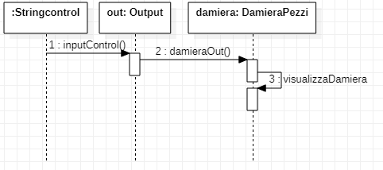
### DIAGRAMMA DELLE CLASSI DELLE USER STORY MOSSA E PRESA
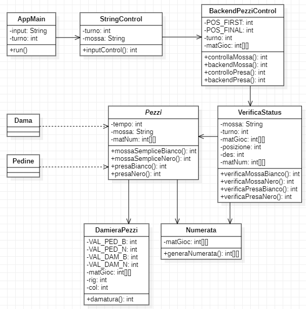
### DIAGRAMMA DI SEQUENZA DELLE USER STORY MOSSA E PRESA
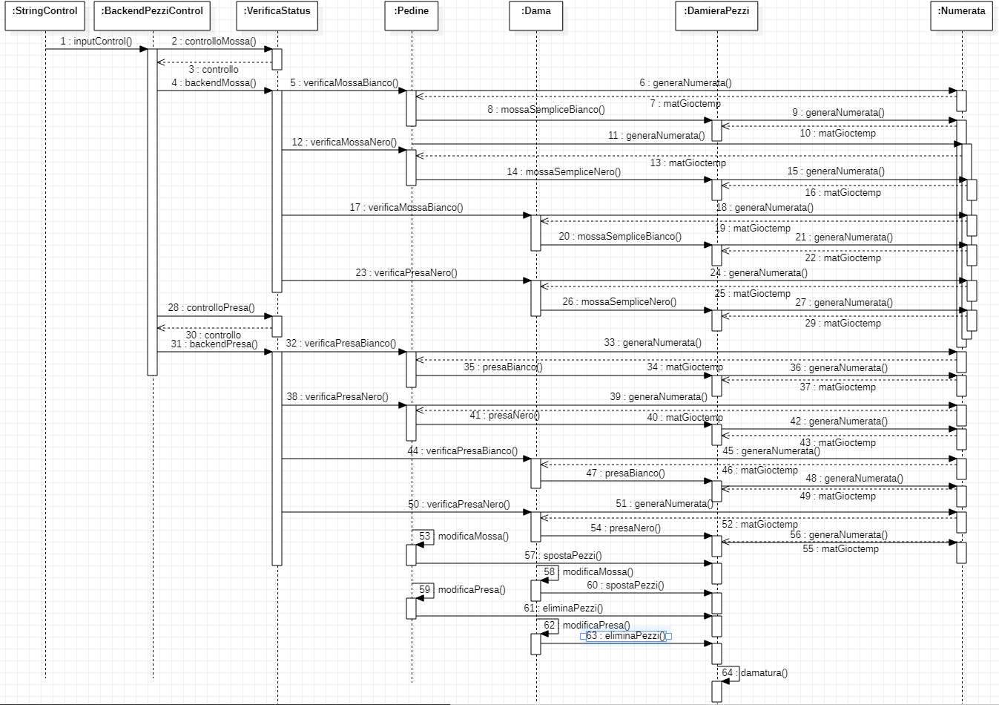
### DIAGRAMMA DELLE CLASSI DELLA USER STORY "ESCI"
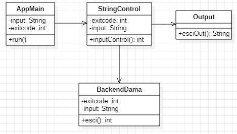
### DIAGRAMMA DI SEQUENZA DELLA USER STORY "ESCI"
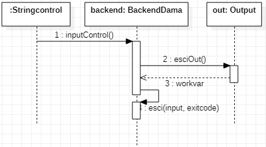
### DIAGRAMMA DELLE CLASSI DELLA USER STORY "TEMPO"
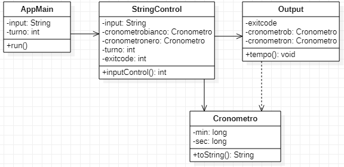
### DIAGRAMMA DI SEQUENZA DELLA USER STORY "TEMPO"
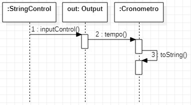

## REQUISITI SPECIFICI 
### REQUISITI FUNZIONALI :
- Il progetto è un’applicazione che permette ad un utente di poter giocare al gioco della dama
- L’applicazione mostra l'help con l’elenco dei comandi:
- Eseguendo il comando help
- invocando l'app con flag, --help o -h
- il risultato è una descrizione coincisa, che normalmente appare all'avvio del programma, seguita dalla lista di comandi disponibili, uno per riga.
- L’applicazione deve permettere al giocatore di iniziare una nuova partita:
- Digitando il comando gioca, se nessuna partita è in corso, l'app si predispone a ricevere la prima mossa di gioco o altri comandi
- L’applicazione deve permettere al giocatore di abbandonare la partita:
- Digitato il comando abbandona, l'app chiede conferma. Se la conferma è positiva, l'app comunica che il Bianco (o Nero) ha vinto per abbandono, altrimenti l'app si predispone a ricevere nuovi comandi
- L’applicazione permette al giocatore di chiudere il gioco:
- Al comando esci  l'applicazione chiede conferma e se essa è positiva, l'app si chiude restituendo un zero exit code, altrimenti l'app si predispone a ricevere nuovi comandi
- L’applicazione permette al giocatore di visualizzare il tempo di gioco quando il gioco è in corso:
- Al comando tempo l'app mostra il tempo trascorso per il Bianco e per il Nero dall'inizio del gioco altrimenti, se il gioco non è in corso, l'app suggerisce il comando gioca e si predispone a ricevere nuovi comandi
- L’applicazione permette al giocatore di mostrare la damiera con i pezzi in modo da visualizzare lo stato del gioco:
- Al comando damiera, se il gioco è iniziato, l'app mostra la posizione di tutti pezzi (in formato Unicode) sulla damiera altrimenti, se il gioco non è iniziato, l'app suggerisce il comando gioca
- L’applicazione permette al giocatore di mostrare la damiera con la numerazione in modo da ricordare come sono numerate le caselle della damiera, l'app mostra la damiera con i numeri sulle caselle nere
- L’applicazione permette al giocatore di spostare una pedina mediante spostamento semplice:
- A partita in corso di gioco, l'app deve accettare mosse di spostamento semplice di pedina in notazione algebrica. Es. 1-5 (rispettando le regole della dama italiana)
- L’applicazione permette al giocatore di spostare una pedina con presa semplice:
- A partita in corso di gioco, l'app deve accettare mosse di spostamento di pedina con presa semplice (rispettando le regole della dama italiana) in notazione algebrica. Es. 18x11 (se è il bianco a muovere)
- L’applicazione permette al giocatore di spostare una pedina con presa multipla:
- A partita in corso di gioco, l'app deve accettare mosse di spostamento di pedina con presa multipla (rispettando le regole della dama italiana) in notazione algebrica. Es. 22x15x6 (se è il bianco a muovere)
- L’applicazione permette al giocatore di spostare una pedina con damatura:
- A partita in corso di gioco, l'app deve accettare mosse di spostamento semplice di pedina in notazione algebrica che terminano con la damatura (rispettando le regole della dama italiana). Es. 6-3 oppure, se c'è una presa, 10x3
- L’applicazione permette al giocatore di visualizzare le prese in modo da valutare se è il caso di offrire una patta o abbandonare:
- Al comando prese l'app mostra le prese del Bianco e del Nero con caratteri Unicode
- L’applicazione permette al giocatore di visualizzare le mosse giocate in modo da poter ripercorrere mentalmente la storia della partita:
- Al comando mosse l'app mostra la storia delle mosse con notazione algebrica 
### REQUISITI NON FUNZIONALI :
- L’ applicazione è supportata dai seguenti terminali:
#### Linux:
- terminal
#### Mac OS
- terminal
#### Windows
- Powershell
-  Terminal del sottosistema Linux per Windows
- Git Bash (in questo caso il comando Docker ha come prefisso winpty; es: winpty docker -it ....)
- Comando per l’esecuzione del container:
- Dopo aver eseguito il comando docker pull copiandolo da GitHub Packages, il comando Docker da usare per eseguire il container contenente l’applicazione è:
- docker run --rm -it docker.pkg.github.com/softeng2021-inf-uniba/progetto2021-pike2021/dama-base2021:latest
- L’applicazione mostra all’utente una schermata di gioco essenziale dove i comandi si presentano semplici da utilizzare grazie all’ausilio dei comandi help e damiera numerata
- L’applicazione si mostra affidabile rispondendo in modo positivo a comandi e azioni non autorizzati che, se mal gestiti, avrebbero potuto provocare una terminazione non voluta dell’eseguibile
- I tempi di risposta dell’applicazione sono rapidi (circa 5-10 secondi) ma, la velocità può essere variabile a seconda delle prestazioni della macchina su cui stiamo operando 
### RIEPILOGO TEST 
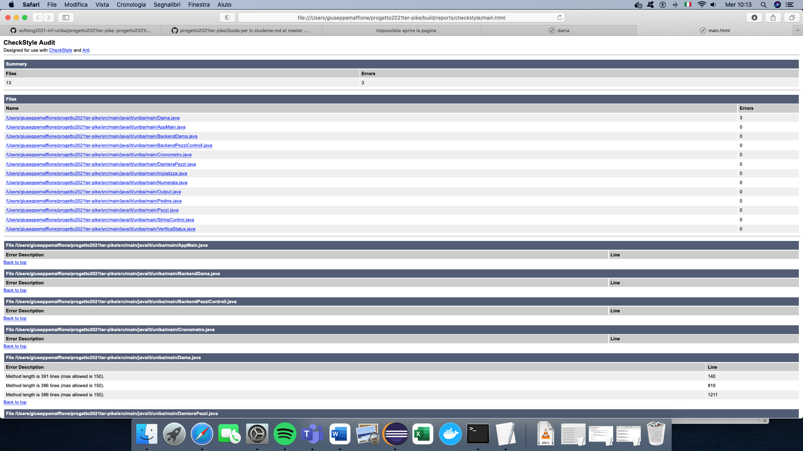
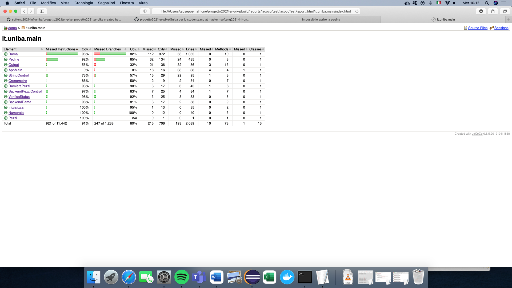
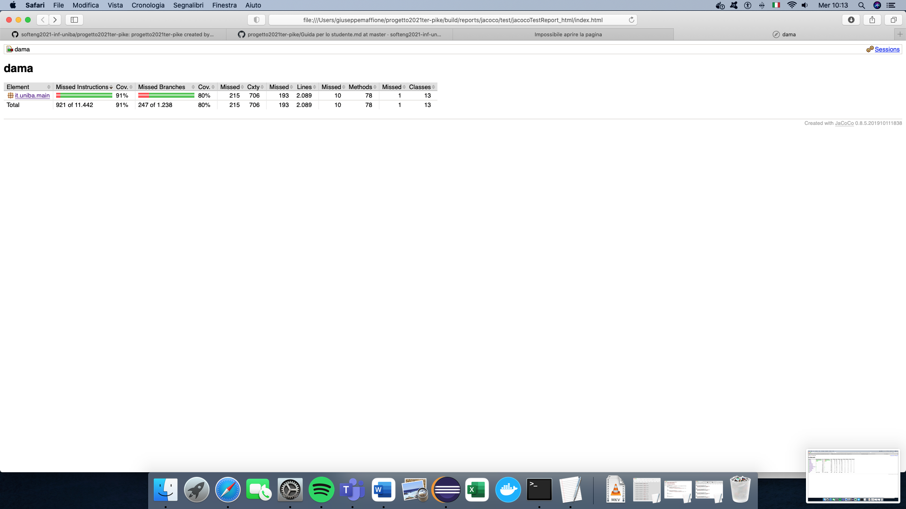

I test sono stati inizialmente incentrati sulle classi dama e pedina, dove sono state tastate le mosse e le prese più critiche che avrebbero potuto far insorgere un’eccezione. Sono state poi valutate in egual misura prese e mosse sia consentite che non. Successivamente i test in Junit si sono soffermati su altre classi che compongono l’applicazione. Le classi BOUNDARY, come MAIN e OUTPUT, non sono state testate in quanto si occupano solo di comunicare con l’utente; le classi che contengono metodi con variabili di ritorno sono state invece tutte testate. 
Altri test sono stati fatti tramite checkstyle, che ci ha permesso di consegnare un codice in linea con gli standard stilistici presenti. Solo 3 errori non sono stati risolti e questi riguardano la lunghezza dei metodi presenti nella classe dama. Sono state tentate varie soluzioni per riuscire a standardizzare i metodi di DAMA ma, il creare differenti sottometodi per risolverne il problema intaccava la comprensibilità del codice stesso che veniva segmentato in più parti e che ne rendevano difficile la comprensione. Per questo motivo è stato deciso di mantenere l’errore.
Un terzo test del codice è stato effettuato tramite spotbug, nel quale si sono riscontrati pochi errori riguardanti le categorie Best Practice e Performance. Essi sono stati tutti risolti.
### PROCESSO, SVILUPPO E ORGANIZZAZIONE LAVORO
L’applicazione è stata sviluppata utilizzando una metodologia di sviluppo agile. Il carico di lavoro è stato equamente distribuito tra i partecipanti. Ogni giorno, durante lo svolgimento di uno sprint, veniva effettuata una riunione per aggiornarsi sulla situazione corrente, trovare eventuali problematiche e concordare sulla strategia migliore da intraprendere. Per gli issue più complessi si è deciso di raggrupparsi in “mini teams”, composti da due o tre persone, che hanno lavorato insieme in video call (causa covid). Gli strumenti della piattaforma Teams si sono dimostrati utili in quanto, con la funzionalità “richiedi il controllo”, più membri hanno avuto la possibilità di utilizzare la loro tastiera per scrivere sul codice del membro che effettuava la condivisione schermo.
Al termine di ogni settimana si effettuava un'ulteriore riunione con lo scopo di comprendere se il lavoro stesse procedendo verso la giusta direzione e per organizzare il lavoro da eseguire durante la settimana successiva. 
Per l’organizzazione i vari membri hanno utilizzato anche altre piattaforme (whatsapp o chiamate telefoniche) in modo da restare sempre in contatto e ottimizzare il lavoro.
Tutti i membri si sono dimostrati collaborativi tra loro, caratteristica preziosa nei momenti di difficolta e che ha permesso di superare molti problemi in maniera efficace. 
## MANUALE UTENTE 
1)	La damiera si compone di 64 caselle alternate per colore, bianche e nere;
2)	Ciascun giocatore dispone all'inizio di 12 pedine di colore diverso da quelle dell'avversario (bianche o nere), collocate sulle prime tre righe di caselle scure poste sul proprio lato della damiera. Il nero occupa le caselle dal n. 1 al n. 12, il bianco quelle dal n. 21 al n. 32;
3)	Inizia a giocare sempre il bianco;
4)	La pedina si muove sempre in diagonale sulle caselle scure un passo alla volta e soltanto in avanti. Quando una pedina raggiunge una delle caselle dell'ultima riga viene promossa e diventa dama. Lo spostamento è effettuato tramite linguaggio algebrico (ex. 1-5);
5)	Ogni pedina può mangiare quelle avversarie che si trovano in avanti, sulla casella diagonale accanto alla propria e che abbiano la casella successiva libera. Le prese possono anche essere effettuate per più volte se la situazione di gioco rende questa situazione possibile. In tal caso la presa si chiama multipla. Le prese sono effettuate utilizzando la notazione algebrica (ex. 1x10);
6)	La dama si muove anch'essa di una casella alla volta, sempre in diagonale, in tutte le direzioni possibili, mangiando sia le pedine che le dame avversarie;
7)	Si vince per abbandono dell'avversario, che si trova in palese difficoltà, o quando si catturano o si bloccano tutti i pezzi avversari;
8)	 Il giocatore può visualizzare i pezzi mangiati tramite il comando presa:
9)	Il giocatore può visualizzare la storia delle prese e mosse semplici con il comando mosse; 
10)	Il giocatore può visualizzare il suo tempo di gioco tramite il comando tempo;
11) Il giocatore può avviare una partita tramite il comando gioca;
12) Il giocatore può abbandonare una partita tramite il comando abbandona;
13) Il giocatore può uscire dall’applicazione tramite il comando esci;
14) Il giocatore in caso di aiuto può utilizzare il comando help;
15)  Il giocatore può visualizzare lo stato delle pedine tramite il comando damiera;
16)  Il giocatore può visualizzare le posizioni di gioco tramite il comando numerata.

## ANALISI DI RETROSPETTIVA
Questo esame professionalizzante si è dimostrato molto utile in quanto ci ha dato la possibilità di gestire autonomamente il progetto fino alla sua completa realizzazione. 
Gli aspetti soddisfacenti riguardano l’organizzazione, in quanto sembrava di star lavorando in una piccola software house. Vedere giorno per giorno l’applicazione prendere vita attraverso le varie implementazioni ci ha resi molto orgogliosi e soddisfatti del lavoro. 
Le parti più insoddisfacenti sono state quelle riguardanti il review degli sprint in quanto, dopo molto duro lavoro, capire che erano presenti delle imperfezioni risultava essere deludente.
Le parti che ci hanno fatto impazzire sono state quelle riguardanti l’implementazione delle funzionalità della dama in quanto la nostra dama può sia muoversi che mangiare e la molteplicità dei casi è stata difficile da gestire, complice anche la scadenza dello sprint. 
Un'altra parte che ci ha fatto impazzire riguarda checkstyle con tutte le sue segnalazioni per linee con spazi bianchi e parentesi senza spazi. Ricercare tutti gli errori presenti si è rivelato più arduo del previsto.
Nonostante gli aspetti positivi e negativi pensiamo che il progetto sia stato tanto formativo. Scadenze e review sono elementi fondamentali del mondo lavorativo e, anche se in piccola parte, ci è stata data la bella possibilità di poter sperimentare il lavoro da programmatori (con metodologia agile).
